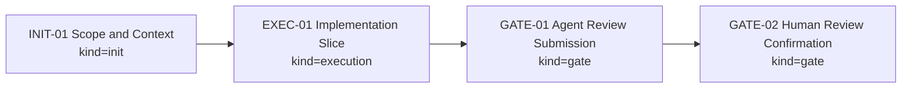

# Operator GUI V2 设计缺陷修复：Terminal 嵌入 + 三元语闭环 + 关系图规模化 + 视图职责重构 - Visual Map

Visual Map Contract: v1.0

This file is the task's diagram collection. It is not only a phase roadmap.
Include only diagrams that materially help a human or agent understand the task.

## Map Index

| ID | Type | Purpose | Required For Understanding | Source Evidence | Promotion Candidate |
| --- | --- | --- | --- | --- | --- |
| MAP-01 | phase | Show the execution phases and dependencies | yes | `task_plan.md` | no |

## Phase Graph

## Phase Table

| Phase ID | Kind | Depends On | State | Completion | Output | Required Evidence | Exit Command | Actor | Evidence Status | Blocking Risk | Owner / Handoff |
| --- | --- | --- | --- | ---: | --- | --- | --- | --- | --- | --- | --- |
| INIT-01 | init | none | planned | 0 | Approved task plan and execution strategy | `task_plan.md`, `execution_strategy.md` | `harness task-start 2026-06-27-harness` | agent | missing | none | coordinator |
| EXEC-01 | execution | INIT-01 | planned | 0 | Scoped implementation, document update, and verification evidence | diff, commands, worker handoff, or artifact path | `harness task-phase 2026-06-27-harness EXEC-01 --state done --completion 100 --evidence present` | agent | missing | [risk] | [owner] |
| GATE-01 | gate | EXEC-01 | planned | 0 | Agent Review Submission | `review.md`, progress update, lesson routing | `harness task-review 2026-06-27-harness --message "
"` | agent | missing | [risk] | coordinator |
| GATE-02 | gate | GATE-01 | planned | 0 | Human Review Confirmation | review packet and human confirmation | Open local Dashboard workbench and confirm `2026-06-27-harness` | human | missing | agent must not perform human confirmation | human |

Allowed Kind: init, execution, gate.
Allowed Actor: agent, human, coordinator.
Allowed Evidence Status: missing, partial, present, waived.

Dashboard implementation completion is computed from non-skipped `execution` phases only. `init` and `gate` phases route lifecycle readiness and next actions; they must not make implementation progress look incomplete.

## Supporting Maps

Add optional diagrams only when useful:

- architecture: module, component, or service structure.
- sequence: frontend/backend/service/database/agent interaction.
- data-flow: data movement and ownership.
- state: state machine or lifecycle.
- topology: repo, service, worker, or worktree layout.
- decision: branch and tradeoff tree.

## Map Notes

- Use `missing` when no evidence has been checked.
- Use `partial` when some evidence exists but required checks remain.
- Use `present` when the phase has sufficient evidence for its current claim.
- Use `waived` only when the reason and owner are recorded in `progress.md`.
