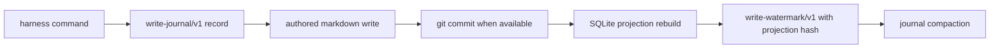

# M1 Minimal Loop

Status: M1 exit contract

## Repository Model

Harness-Anything uses one shared authored harness and one local generated cache.

- Shared authored state lives under `harness/`.
- Local generated state lives under `.harness/`.
- Task packages live under `harness/planning/tasks/`.
- Task IDs are random `task_<ULID>` values. Slugs and titles are display metadata, not identity.
- Generated projection, write journal, locks, payload refs, and adoption claims are local machine state and must not be committed.

This model is designed for multiple people working in the same Git repository. Authored task packages merge through normal Git review. Generated state is rebuilt locally after checkout, task writes, and merges.

## Task State Machine

Local task state is the six-state domain vocabulary:

- `planned`
- `active`
- `blocked`
- `in_review`
- `done`
- `cancelled`

`done` and `cancelled` are terminal. Follow-up work after terminal state uses `harness task supersede`, not reopen. Archive and tombstone are package disposition changes; they do not invent new lifecycle states.

## Write And Projection Flow



The markdown task package is the source of truth. SQLite is a rebuildable projection cache. The watermark records the committed op IDs, commit SHA, and content hash of the rebuilt projection rows.

Journal compaction removes `write-journal/v1` records already covered by the watermark. Audit records such as hard-delete application and stale-lock takeover remain in the journal.

## Agent Workflow

Use this loop for local work and after pulling or merging:

```bash
harness status --json
harness check --post-merge --json
```

If `check` reports `ok: false`, inspect `report.axes` first:

- `source-package`: authored markdown issues such as duplicate task IDs, duplicate external bindings, binding tamper, malformed packages, dangling task refs, or relation cycles.
- `generated-cache`: local projection cache issues such as missing, stale, or tampered SQLite state.
- `collaboration-gate`: merge hygiene issues such as tracked generated files or unresolved conflict markers.

Fix authored problems in `harness/`. Fix generated cache problems by rebuilding or deleting `.harness/` cache state. Never resolve generated cache problems by editing SQLite or journal files by hand.

## Command Boundary

`harness governance rebuild` is the explicit rebuild command for generated governance projections. `harness check` validates the source package, generated cache, and collaboration gates. Keeping rebuild and check separate lets merge-time agents run a read-oriented check while still having an explicit repair command when generated state is missing or stale.

## Exit Checklist

- `harness init` creates shared authored state and ignores `.harness/`.
- `harness new-task` creates random task IDs.
- `harness status --json` returns task counts, command registry, warnings, and `harness-check-report/v1`.
- `harness check --post-merge --json` returns the three-axis check report.
- Write watermarks use a real projection rows hash.
- Journal compaction keeps recovery idempotent and preserves audit records.
