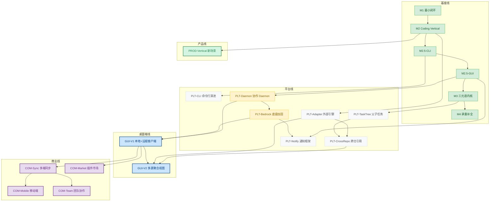

# 70 · 全局路线图 — 产品线版 (Global Roadmap — Product Lines)

- **状态**: canonical
- **日期**: 2026-06-14（2026-06-12 初版线性编号；2026-06-14 重构为产品线模型；2026-07-02 同步 M2.5 收口与 M3/M4 现状；2026-07-03 同步 M3 exit 与 M4 承重补全宪章；2026-07-03 同步 M4 exit；2026-07-06 新增 PLT-Daemon 并调整 GUI-V1 依赖，锚 dec_mr9abn9x/dec_mr9ac5ca/dec_mr9acscw/dec_mr9acuxm；2026-07-07 新增 PLT-Bedrock 与 L0 批次序列，锚 dec_mra9ag8o/dec_mra363jk）

## 1. 目的

本目录是 Harness-Anything clean-room rewrite 的**全局交付路线图**。2026-06-14 起，路线图从线性编号（M1→M2→…→M6）重构为**产品线模型**：M2.5 之后路线自然分叉为多条技术上可并行的产品线，每条线有自己的里程碑序列。

每个里程碑结束时，系统必须处于可用状态。

## 2. 五条产品线

| # | 线名 | 英文 ID | 职责 | 开源/闭源 |
|---|------|---------|------|----------|
| 0 | **基座线** | `foundation` | M1/M2/M2.5，已完成/进行中的历史底座 | 开源 |
| 1 | **平台线** | `platform` | 底层能力：父子任务、外部 Adapter、跨仓引用、通知框架、CLI 演进 | 开源 |
| 2 | **桌面端线** | `gui` | Electron 桌面客户端：V1 本地+远程、V2 多源聚合视图 | 开源 |
| 3 | **产品线** | `product` | 新 Vertical 场景的持续开发（Research、Design、Operations 等）| 开源 |
| 4 | **商业线** | `commercial` | 账号同步、移动端、团队协作、插件市场 | 闭源 |

## 3. 全局里程碑一览

### 基座线 (Foundation) — 不改名

| 里程碑 | 一句话目标 | 状态 |
|--------|-----------|------|
| M1 最小闭环 | Kernel + local engine + CLI 可 dogfood 自身 | ✅ 完成 |
| M2 Coding Vertical | 旧版日常功能等价对齐 | ✅ 完成 |
| M2.5-CLI | Dogfood + Legacy Intake | ✅ 收口（批量便捷命令显式低优先 defer） |
| M2.5-GUI | Daemon 协议 + 契约硬化 | ✅ 收口（contract-ready；daemon runtime 实现归 GUI-V1） |
| M3 三元语内核 | decision/fact/relation/provenance:内核从 task-only 扩为三元语+血管+溯源;R1-R5 remediation 已闭环;85/86 存量包 provenance 已回填;open 台账出清为真实在办 | ✅ 完成（exit 2026-07-03） |
| M4 承重补全 | Foundation 收尾后的承重补全:WP0 canonical 修补→WP2' fact 分类 schema→WP3 runtime event ledger→WP4 docmap 最小集→WP5 风化 spike→WP6 graph 全景 Skill→WP7 `ha distill` 手动基线;业务能力后置 PLT/GUI/COM | ✅ 完成（exit 2026-07-03，E71 双盲红队 + remediation PR #141;复盘判定采用层 shipped-unused,见 M3-M4-reckoning） |
| M5 循环接通·基础补全·文档自宿主 | 循环接通(W0-W3)+**基础补全 F 系列**(执行中涌现:F1 读对齐/F2 CRUD 派生/F3 fact 门/F4 relation 血管/F5 实体 CRUD 框架/F6 CLI 人体工学+活文档,E73-E77)+文档自宿主(W4-W8);exit=自举 + foundation 基线(relation 真流起来+CRUD 可声明+CLI agent 顺手) | ✅ 完成（exit 2026-07-07，exit-blocker PR #240 合并，ha status 绿，dec_mraakr5s；W4/W6 深化自举后置 PLT/M6）|

### 平台线 (Platform)

| 里程碑 ID | 名称 | 一句话目标 | 入口条件 |
|-----------|------|-----------|---------|
| PLT-CLI | 命令行演进 | Parser 拆分、命令注册、补全、输出格式化 | M2.5-CLI |
| PLT-TaskTree | 父子任务 | 任意深度父子关系、环检测、软门禁 | M2.5 |
| PLT-Adapter | 外部引擎 | Multica/GitHub/Linear 只读状态映射 | M2 |
| PLT-CrossRepo | 跨仓引用 | EntityRef、跨仓父子、产品线声明 | PLT-TaskTree + PLT-Adapter |
| PLT-Notify | 通知框架 | 事件总线 + Webhook/邮件/Slack/钉钉 | M2.5 + PLT-Bedrock W4 |
| PLT-Daemon | 协作 Daemon | 单写者 daemon 托管 canonical harness：JSON-RPC 协议、身份+轻量 RBAC、唯一合法写路径；单人/团队同一架构 | 四裁决 accepted（✅ 2026-07-06）+ M5 主线不受阻断 |
| PLT-Bedrock | 底盘加固 | port 纪律清零、投影变化事件、daemon 常驻验证、防腐闸门；为 PLT-Fleet / GUI-V1 / PLT-Notify / 商业线提供已验证 L0 底盘 | dec_mra9ag8o active + 融合审计 G1-G4/C1-C8 + root task `task_01KWXKJ4M8N9TCE7Q8Q8NWY8Z7` |

### 桌面端线 (GUI)

| 里程碑 ID | 名称 | 一句话目标 | 入口条件 |
|-----------|------|-----------|---------|
| GUI-V1 | V1 本地+远程客户端 | Electron + 核心视图 + SSH 远程 + 桌面通知 + 打包（daemon runtime 由 PLT-Daemon 提供，GUI-V1 消费不自建；Phase 1 消费 PLT-Bedrock W4 投影变化事件） | M2.5-GUI + PLT-Daemon + PLT-Bedrock W4 |
| GUI-V2 | V2 多源聚合视图 | 跨仓/跨 Adapter 聚合只读快照 | GUI-V1 + PLT-Adapter + PLT-CrossRepo |

### 产品线 (Product)

| 里程碑 ID | 名称 | 一句话目标 | 入口条件 |
|-----------|------|-----------|---------|
| PROD-Vertical | 新 Vertical 场景 | Research/Design/Operations 等非 Coding Vertical 持续开发 | M2 |

### 商业线 (Commercial)

| 里程碑 ID | 名称 | 一句话目标 | 入口条件 |
|-----------|------|-----------|---------|
| COM-Sync | 多端同步+账号 | 用户账号、设备绑定、投影级同步 | GUI-V1 + 商业 ADR |
| COM-Mobile | 移动端 | 手机查看+Human Review | COM-Sync |
| COM-Team | 团队协作 | 多租户 RBAC、共享看板、指派 | COM-Sync |
| COM-Market | 插件市场 | Vertical/Preset/Template 一键安装市场 | GUI-V1 |

## 4. 全局依赖图



## 5. 文档组织（目标结构）

```text
harness/milestones/
├── README.md                          ← 本文件
├── 00-decision-ledger.md
├── 00-packet-contract-template.md
├── 01-parity-matrix.md
├── 02-implementation-status-matrix.md
│
├── foundation/                        ← 基座线
│   ├── m1-minimal-loop/
│   ├── m2-coding-vertical/
│   ├── m2-5-cli/
│   └── m2-5-gui/
│
├── platform/                          ← 平台线
│   ├── plt-cli/
│   ├── plt-task-tree/
│   ├── plt-adapter/
│   ├── plt-cross-repo/
│   ├── plt-notify/
│   ├── plt-daemon/
│   └── plt-bedrock/
│
├── gui/                               ← 桌面端线
│   ├── gui-v1-local-remote/
│   └── gui-v2-aggregation/
│
├── product/                           ← 产品线
│   └── prod-vertical-expansion/
│
└── commercial/                        ← 商业线
    ├── com-sync/
    ├── com-mobile/
    ├── com-team/
    └── com-market/
```

> **迁移状态**: 旧线性里程碑目录已迁入对应产品线文件夹；产品线版草案已提升为本文件。后续新增里程碑必须落在对应产品线目录内。

## 6. 排序原则

- M1/M2/M2.5 是所有线的共同基座。
- 平台线的里程碑为 CLI 和 GUI 共同提供底层能力，交付后自然增强两个消费端。
- GUI 线与平台线可大范围并行（GUI-V1 不依赖 PLT-TaskTree/PLT-Adapter）。
- 产品线（Vertical 扩展）在 M2 之后即可启动，不依赖其他线。
- 商业线在 GUI-V1 之后启动，是产品向 SaaS 的跃迁。
- 每条线内部的里程碑按技术依赖严格排序；跨线依赖在全局依赖图中标注。

### 2026-07-07 补充：PLT-Bedrock 与 L0 之上批次序列

- **批次 A（现在）**：PLT-Bedrock 开工；GUI-V1 继续推进，但 Phase 1 依赖 PLT-Bedrock W4 投影变化事件；PLT-Daemon 团队模式 residuals 并入 PLT-Bedrock W5。
- **批次 B（Bedrock W1-W4 落地后）**：PLT-Fleet charter 裁决并开工；Sentinel 开源查询缝推进 09§5 的接口部分。
- **批次 C（Fleet 自举出使用证明后）**：商业线 re-charter 落地为 COM 各里程碑（老板套餐、托管控制面等）；个人线产品化按 17§5 排序纪律再评估。
- **批次 D（P4）**：A2A 联邦 / Human API 市场。

### 2026-07-02 补充：三元语内核（M3）对各线的传导

- **M3 是新的语义基线**：M2.5 之前立项的设计（GUI 8 视图规格、PLT-TaskTree relation 写路径、PLT-CrossRepo 跨仓 parent 声明）多以"task 为唯一 entity"为前提，启动前必须对齐 E41/E51 的三元语与 entity-relations 模型，不得按旧稿直接实现。
- **PLT-TaskTree**：relation 写模型改为 owner entity metadata 内的 typed records（M3 TP-06 落地后），`task relate` 不再是通用 edge writer；其实现 phase 依赖 M3 exit。
- **GUI 线**：GUI-V1 入口条件不变（M2.5-GUI 已收口，daemon runtime/壳层工作可即刻并行 M3）；但核心视图规格需按三元语改版（Decision/Fact 升一等、闸门=决策现场），改版设计工作与 M3 实现并行，三元语视图实现消费 M3 RelationGraphProjection。
- **M4** 与 PLT-TaskTree 正交，均为 relation 图投影的消费者。

### 2026-07-03 补充：M4 承重补全重定义

- **M3 已 exit**：M3 在 2026-07-03 完成 remediation 后收官，R1-R5 账实核对闭环；后续 M4 入口不再 blocked 于 M3 TP-06/TP-12b。
- **M4 supersedes 单 spike 口径**：2026-06-14 的 "M4 瘦身为单验证 spike"已被 E63 覆盖。TP-M4-01 风化查询仍保留，但只是 M4 WP5，不再定义整个里程碑。
- **M4 baseline 不含业务产品化**：workflow runner、create-agents、LoongSuite/gateway、Agent-as-a-Judge、多人协作深化、GUI/daemon 业务落地均后置；M4 只补可承载这些业务的 fact/event/docmap/graph/distill 地基。
- **M4 exit gate**：必须执行 decision-ledger walk（E63-E70 设计→实现穷尽枚举）与 Opus×Codex 双盲红队（E71）。

## 7. 与其他顶层文件夹的关系

| 文件夹 | 组织方式 | 是否受产品线重构影响 |
|--------|---------|-------------------|
| `10-foundation/` | 按主题（全局设计基础） | 不变 |
| `harness/contracts/` | 按主题（跨线约束） | 不变，新增合同按需创建 |
| `40-gui-and-apps/` | GUI 设计文档 | 不变，天然对齐 GUI 线 |
| `50-adapters/` | Adapter PRD | 不变，天然对齐 PLT-Adapter |
| `harness/milestones/` | **按产品线** | **重构** |
| `90-evidence/` | 审查记录 | 不变 |
