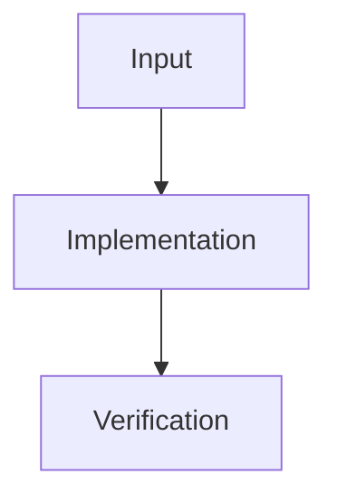

# Visual Map

## Flow

## Phase Table

| Phase ID | Kind | Depends On | State | Completion | Output | Required Evidence | Exit Command | Actor | Evidence Status | Blocking Risk | Owner / Handoff |
| --- | --- | --- | --- | ---: | --- | --- | --- | --- | --- | --- | --- |
| INIT-01 | init | none | planned | 0 | plan | task_plan.md | n/a | coordinator | pending | unknown | coordinator |

## Ownership

Record module, file, and responsibility boundaries.
